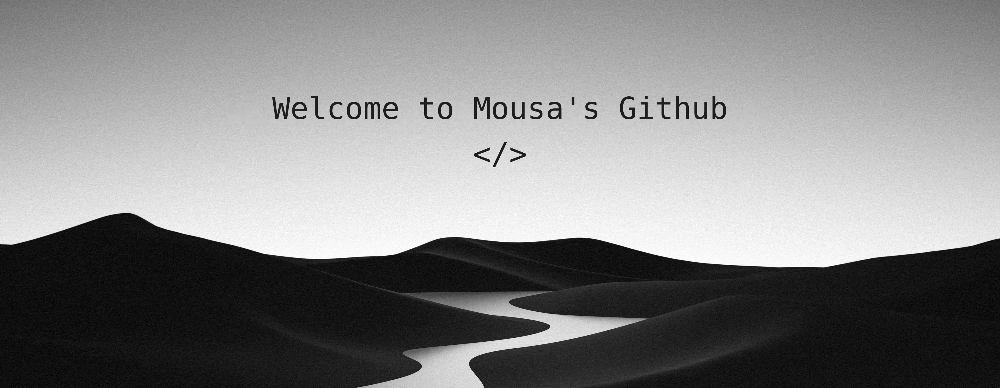

  
  
  
  

 

<h2 align="center">  <em>About me </em></h2>

 

  Hello There! <em><b> I'm Mousa Alawad </b></em>, a Software Engineering student and Full Stack Developer. I enjoy learning new technologies and problem solving. I design and build full-stack applications, algorithmic tools, and interactive systems — turning complex logic into clear, useful, and precise user experiences.

 

      <em><b> Studying IT Engineering </b></em>  
      <em><b> Full Stack Developer </b></em> 
      <em><b> Builder of Tree Visualizer (BST & AVL) </b></em> 
      <em><b> Enthusiast in Algorithms & AI </b></em> 

 
 
<h2 align="center">  <em> Technologies </em> </h2>

  
  
  
  
  
  
  
  
  
  

 

<h2 align="center">  <em> Statistics </em> </h2>

 

